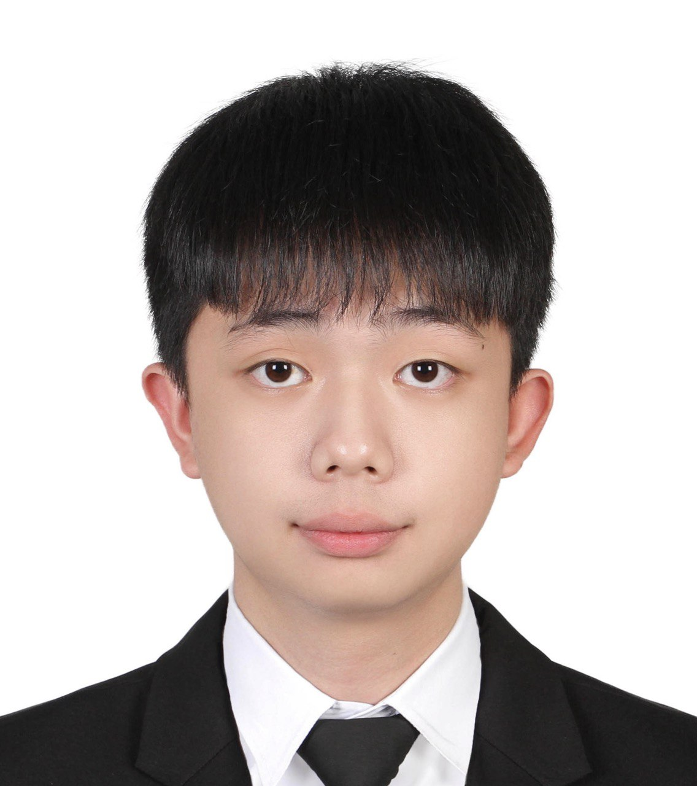

# About Us

We are a team based in the [School of Computing, National University of Singapore](http://www.comp.nus.edu.sg).

You can reach us at the email `seer[at]comp.nus.edu.sg`

## Project team

<<<<<<< master
### Chen Haozhe

[[github](https://github.com/chenzmxy)]
[[portfolio](team/johndoe.md)]
=======
### Kai Jie

[[github](https://github.com/johndoe)]
>>>>>>> master

* Role: Developer
* Responsibility: Documentation 

### Gracia Chew

[[github](http://github.com/gracias022)]

* Role: Team Member

### Johnny Doe

[[github](http://github.com/johndoe)] [[portfolio](team/johndoe.md)]

* Role: Developer
* Responsibilities: Data

### Jean Doe

[[github](http://github.com/johndoe)]
[[portfolio](team/johndoe.md)]

* Role: Developer
* Responsibilities: Dev Ops + Threading

### James Doe

[[github](http://github.com/johndoe)]
[[portfolio](team/johndoe.md)]

* Role: Developer
* Responsibilities: UI
